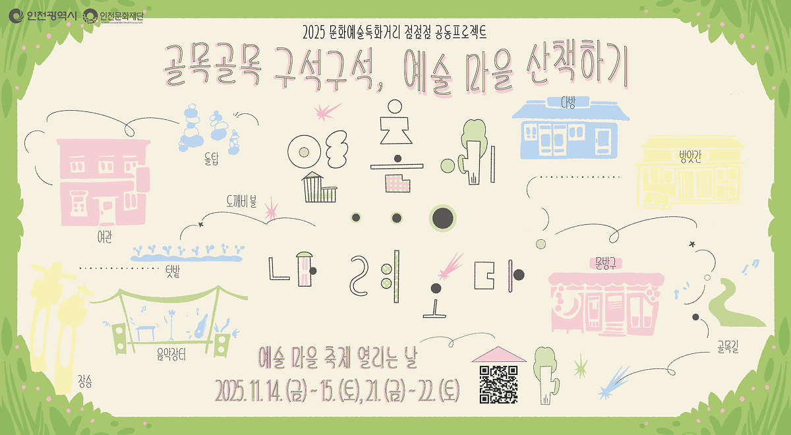

  <h1> [ APPS X 인천문화재단 ] 2025 문화예술특화거리 점점점 </h1>
   

 

#  점점점 소개

> APPS x 인천문화재단 협업 2025 문화예술특화거리 점점점 공동 프로젝트 웹사이트

#### 예술가들의 작업실이 정겨운 시골 마을로 변신합니다! 미추홀구, 중구, 동구 세 개 군구에 있는 10개의 문화공간에서 펼쳐지는 특별한 문화 체험에 여러분을 초대합니다.
 

| 전시 사이트 주소 | [2025dotdotdot.com](https://www.2025dotdotdot.com/) |
| :---: | :---: |
| **프로젝트 개발 기간** | 2025.8. ~ 2025.11. |
 

#  주요 서비스

### 🖼 참여 문화공간 아카이브 
- 인천 미추홀구, 중구, 동구에 위치한 10개의 문화공간 정보를 제공합니다.

### 📍 전시 안내 
- 2025 문화예술특화거리 점점점 전시의 상세 정보를 확인할 수 있습니다.

### 🗺 공간 위치 한눈에 보기 
- Google Maps 연동을 통해 각 문화공간의 위치를 지도에서 확인할 수 있습니다.
 

#  팀원 소개
|  |  |  |  |   |
|:-----------------------------------------------------------------------------------------------:|:-----------------------------------------------------------------------------------------------:|:-----------------------------------------------------------------------------------------------:|:-----------------------------------------------------------------------------------------------:|:-----------------------------------------------------------------------------------------------:|
| [윤지원](https://github.com/rosaze) | [백수민](https://github.com/suminb99) | [하지민](https://github.com/JiiminHa) | [임유진](https://github.com/uuzjin) | [김영교](https://github.com/ygkgy0105) |
| `PM` | `PM` `프론트엔드` | `PM` `프론트엔드` | `프론트엔드` | `프론트엔드` |
 

#  데모 영상
| 모바일 | 데스크탑 | 
| :---: | :---: |
|  |  |
 
